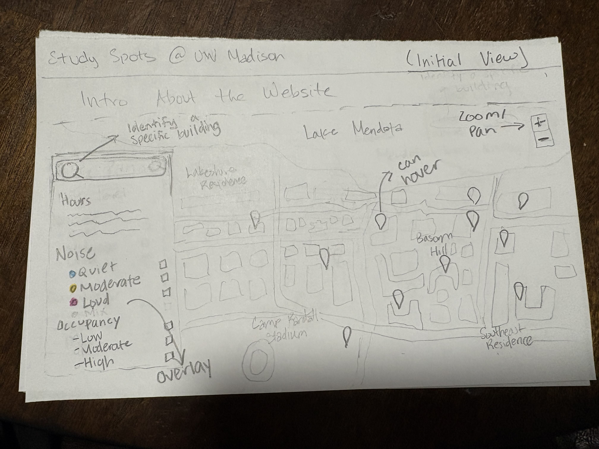
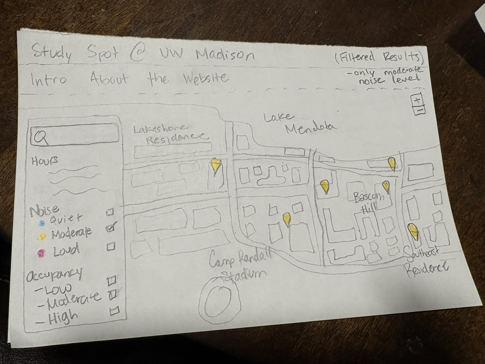
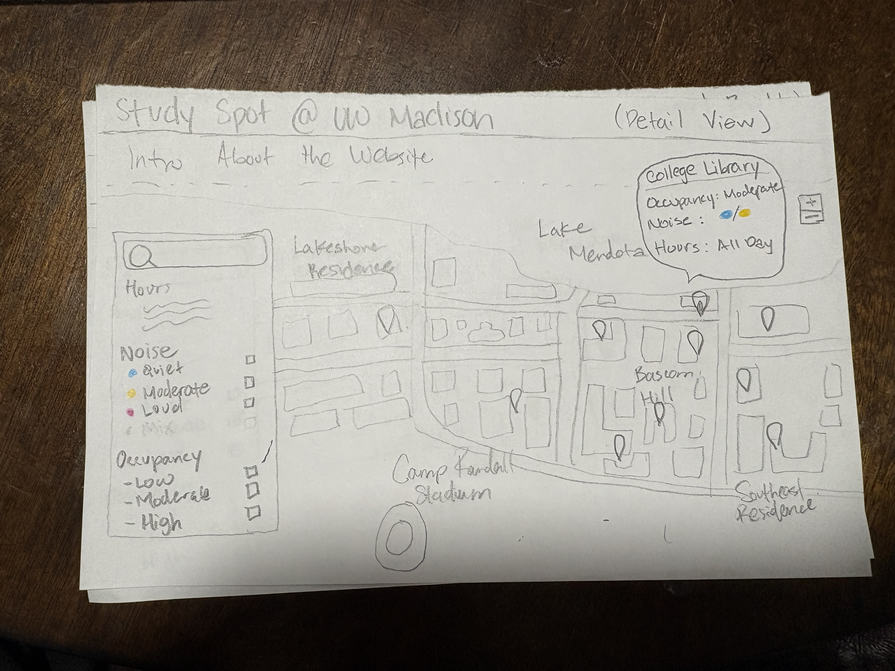

# UW Study Spots Finder: An Interactive Map for Student Study Needs

## Project Team Members
- Rachel Ren  
- Yufei Xia  
- Ray Weigand  

## Persona

Hannah is a freshman on the pre-med track adjusting to the academic intensity of college. Her coursework requires long hours of focused studying, memorization, and review. However, she struggles to consistently find study spaces that match her needs. She wants a place that is quiet enough for concentration, but not completely isolating.
 As a new student, Hannah is unfamiliar with many campus buildings and study areas. She often feels overwhelmed with numerous locations only to find spots that are too crowded, too noisy, or already full. Due to her busy schedules, efficiency is critical, and she needs to quickly identify reliable study environments between classes. 
Her priority is to find study areas that are quiet, but not overcrowded, allowing her  to concentrate without distractions while still having access to seating. Due to the numerous buildings available, she finds it difficult to compare and evaluate different study locations based on nose level and availability. She would like to develop insights related to patterns of peak hours, noise trends, and underutilized locations across campus. By using the interactive, Hannah aims to filter out which study areas she should rely on given their noise levels, occupancy patterns, and proximity, in order to achieve her goal of efficient and productive studying.

## Scenario

After finishing a lecture, Hannah has a two-hour gap before her next class and wants to find a good place to study. She opens the interactive map and begins by using the query panel to filter locations by time and proximity to his building. The map updates display nearby study spaces. Hannah notices several options and turns on noise level overlay like quiet, moderate, or loud. Different colors on the map help him quickly interpret environmental conditions,
She hovers over a few locations to view detailed information such as average occupancy, noise, and available seating. One library floor appears quiet but highly crowded, while another study lounge shows moderate noise and lower occupancy.
 To refine her choice, Hannah applies a filter to prioritize “moderate” occupancy levels. The results panel updates to rank locations that balance quietness with available space. Through this interaction loop of querying and filtering. Hannah efficiently finds a study space that meets her needs, allowing her to stay focused and productive.

## Requirements

### Interaction

**Zoom & Pan:**
Users can navigate the campus map to explore study locations at different spatial scales. This supports general exploration and spatial awareness.

**Filter (Dynamic Query):**
Users can filter study spaces based on attributes such as:
hours of operation (e.g., late-night)
noise level (quiet, moderate, loud)
occupancy level
These filters update the map dynamically, allowing users to refine results in real time.

**Search:**
Users can search for specific buildings or locations directly, supporting quick lookup when users already have a place in mind.

**Retrieve (Details-on-Demand):**
By clicking or hovering over a location, users can view additional information such as:
current or average occupancy
noise level
available seating/resources

**Overlay / Resymbolization:**
Noise levels and occupancy are visually encoded using color or symbol variations, allowing users to quickly compare locations.

## Representation

The map represents study spaces as point features across the UW-Madison campus.

**Map Type:**
A 2D interactive web map displaying campus geography and study locations.

**Symbols:**
Points represent individual study spaces (libraries, cafes, lounges)
Different icons or shapes distinguish between types of locations (e.g., library vs. café)

**Visual Variables:**
Color is used to encode noise levels (e.g., quiet = blue, moderate = yellow, loud = red)
Size or opacity may represent occupancy levels

**Base Map:**
A simplified campus basemap provides spatial context (buildings, streets, landmarks)

**Attribute Data:**
Each study space includes:
name
hours of operation
noise level
occupancy level
available resources (e.g., outlets, seating)

This representation allows users to quickly identify, compare, and evaluate study spaces based on both spatial and environmental attributes.

## Wireframes

### Wireframe 1 – UI Layout

### Wireframe 2 – Filtering & Navigation

### Wireframe 3 – Details on Demand

